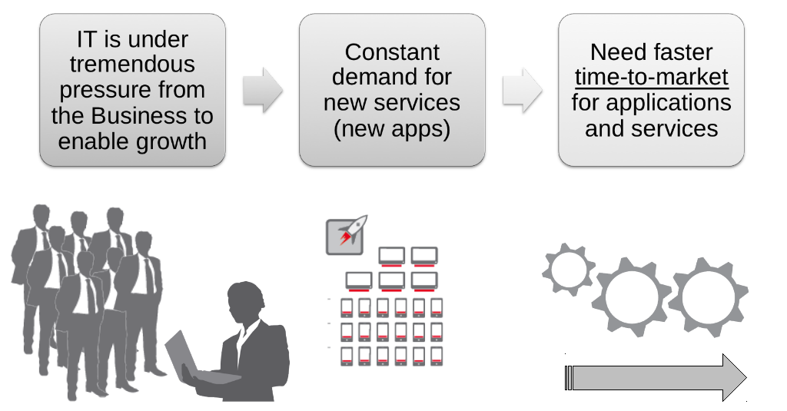

### Red Hat and DevOps
Jeremy Brown - Head of Middleware UK&I, Red Hat

[@tenfourty] [1]
[1]: http://twitter.com/tenfourty/ "@tenfourty"
<jeremy@redhat.com>

---

## What links all of these technologies?

 <!-- .element: class="noshadow" style="float: right" --> <!-- .element: class="fragment" data-fragment-index="2" -->

* Android
* Facebook
* Amazon WS
* Hadoop
* Linux
* OpenStack

All based on Open Source, the engine of innovation <!-- .element: class="fragment" data-fragment-index="1" -->

---

### Lets talk about some **principles** for selecting software
Lets call them Jeremy's golden rules for buying ;-)

1. Software for your enterprise needs to be proven and ready for production <!-- .element: class="fragment" data-fragment-index="1" -->
2. Everything you run in production should have long term enterprise grade support <!-- .element: class="fragment" data-fragment-index="2" -->
3. Your cost of aquisition for software should be minimal (license plus training etc.) and the ongoing cost should be predicatable <!-- .element: class="fragment" data-fragment-index="3" -->
4. Your TCO calculations should include the Cost of Exit and should be factored in during the selection process <!-- .element: class="fragment" data-fragment-index="4" -->
5. Your exposure to Vendor lock-in should be minimised and you should be able to walk away and keep the bits <!-- .element: class="fragment" data-fragment-index="5" -->
6. You shouldn't pay for upgrades! <!-- .element: class="fragment" data-fragment-index="6" -->

--

### And some bonus rules for Open Source
#### Though you might apply them to proprietary software too <!-- .element: class="fragment" data-fragment-index="1" -->

1. What is the size and adoption of the community behind this solution? Is it still growing? <!-- .element: class="fragment" data-fragment-index="2" -->
2. How open is the community? Does the license allow the community to fork the code?  <!-- .element: class="fragment" data-fragment-index="3" -->

--

## Red Hat's Model: Community Powered Innovation
### Does it meet Jeremy's rules?  <!-- .element: class="fragment" data-fragment-index="1" -->

--

## Many variations vendors take on open source

* Some enable optimizations for their hardware <!-- .element: class="fragment" data-fragment-index="1" -->
* Some use open-core to upsell proprietary add-ons <!-- .element: class="fragment" data-fragment-index="2" -->
* Some invest in focused areas <!-- .element: class="fragment" data-fragment-index="3" -->
* Some contribute little and soley ship and support <!-- .element: class="fragment" data-fragment-index="4" -->

--

## AND SOME...
# GO ALL IN <!-- .element: class="fragment" data-fragment-index="1" -->

--

 <!-- .element: class="noshadow" fullscreen-size="contain" -->

--

 <!-- .element: class="noshadow" fullscreen-size="contain" -->

--

## Is Open Source a Business Model?

* No <!-- .element: class="fragment" data-fragment-index="1" -->
* But it is the best DEVELOPMENT model on the planet <!-- .element: class="fragment" data-fragment-index="2" -->
* Enables collaboration <!-- .element: class="fragment" data-fragment-index="3" -->
* Gives users flexibility to consume on their terms <!-- .element: class="fragment" data-fragment-index="4" -->
* Red Hat's subscription model is our business Model. <!-- .element: class="fragment" data-fragment-index="5" -->

---

## DevOps

It's where Developers and Operations meet -> DevOps

 <!-- .element: class="noshadow" -->

### Ugh, that feels like a horrible trite definition! <!-- .element: class="fragment" data-fragment-index="1" -->

--

## So Really, What Is DevOps?
### To Understand It Let's Take A Step Back <!-- .element: class="fragment" data-fragment-index="1" -->

--

## Today's IT Challenge

 <!-- .element: class="noshadow" -->

--

### Lessons from the B-24 Bomber
 <!-- .element: class="noshadow" fullscreen-size="contain"-->

--

### Manufacturing as a Model for IT
#### Consolidated Aircraft B-24 Liberator

* Incredibly sophisticated. ~500k parts, assembled by unskilled labor. 
* No Mfg process. Parts were cast in rubber molds, so every part was slightly different.
* Assembled in the heat of San Diego, which warped the metal and required whole assemblies to be adjusted.
* Charles Sorenson of Ford Motor Co. brought a Manufacturing process … went from 250 planes a year to 650 planes a month.

### **THIS IS OUR CHALLENGE TODAY.**<!-- .element: class="fragment" data-fragment-index="1" -->

--

### Sorenson's Lessons from the B-24

* Standard Parts
* Standard Process
* Standard Infrastructure
* Build For Change

--

### Sorenson's Lessons from the B-24

* ***Standard Parts***
    * Standardized
    * Interoperable
    * Multi-vendor
* Standard Process
* Standard Infrastructure
* Build For Change

--

### Sorenson's Lessons from the B-24

* Standard Parts
* ***Standard Process***
    * Eliminate redundancy
    * Encourage flexibility
    * Drive modularity
* Standard Infrastructure
* Build For Change

--

### Sorenson's Lessons from the B-24

* Standard Parts
* Standard Process
* ***Standard Infrastructure***
    * Process drives tools
    * Not the other way around
* Build For Change

--

### Sorenson's Lessons from the B-24

* Standard Parts
* Standard Process
* Standard Infrastructure
* ***Build For Change***
    * Turn craftwork into commodities
    * Design for improvement, not function

--

##### The B-24 ended World War II as the most produced heavy bomber in history. At over 18,400 units, half by Ford Motor Company, it still holds the distinction as the most-produced American military aircraft.

https://en.wikipedia.org/wiki/Consolidated_B-24_Liberator

--

### DevOps in Summary

* DevOps is about bringing the manufacturing line revolution to IT
* Think about the B-24 Bomber, lean production and Toyota
* First and foremost this is all about cultural change
* "DevOps" is really just an unfortunate name

--

## If I Could Recommend Just One Book...

THE PHOENIX PROJECT: A NOVEL ABOUT IT, DEVOPS, AND HELPING YOUR BUSINESS WIN

BY GENE KIM, KEVIN BEHR AND GEORGE SPAFFORD

 <!-- .element: class="noshadow" -->

--

### Deliver IT Success as an IT Manufacturer, not an IT Craftsman

 <!-- .element: class="noshadow" fullscreen-size="contain"-->

--

### PaaS Lets You Streamline App Dev

 <!-- .element: class="noshadow" fullscreen-size="contain"-->

---

--

## Now we need some buzzwords
### these are key themes that have influenced my thinking <!-- .element: class="fragment" data-fragment-index="1" -->

--

## [Pets vs Cattle] [1]

* Pets are given names like pussinboots.cern.ch <!-- .element: class="fragment" data-fragment-index="1" -->
* The are unique, lovingly hand raised and cared for <!-- .element: class="fragment" data-fragment-index="1" -->
* When they get ill, you nurse them back to health <!-- .element: class="fragment" data-fragment-index="1" -->
* Cattle are given numbers like vm0042.cern.ch <!-- .element: class="fragment" data-fragment-index="2" -->
* They are almost identical to other cattle <!-- .element: class="fragment" data-fragment-index="2" -->
* When they get ill, you get another one <!-- .element: class="fragment" data-fragment-index="2" -->

 <!-- .element: class="fragment" data-fragment-index="1" -->  <!-- .element: class="fragment" data-fragment-index="2" -->

Future application architectures should use Cattle but Pets with strong configuration management are viable and still needed <!-- .element: class="fragment" data-fragment-index="3" -->

[1]: http://www.slideshare.net/gmccance/cern-data-centre-evolution

--

## Continuous Delivery

 <!-- .element: class="noshadow" -->

https://en.wikipedia.org/wiki/Continuous_delivery

--

## Lean Startup
##### It's not just for startups, it's a cultural pattern

 <!-- .element: class="noshadow" -->

#### Lets ship the MVP (Minimum Viable Product)!

http://theleanstartup.com/principles

---

## Cloud without open source software?
* No Amazon
* No Rackspace
* No Google
* No Yahoo!
* No Salesforce.com
* No LinkedIn
* No Pandora
* No Twitter
* No Facebook

---

## Thank you
This [presentation] [1] is running on [OpenShift] [2],

the source code is on [GitHub] [3]

and it was developed in HTML5 with [reveal.js] [4]

Jeremy Brown [@tenfourty] [5]

[1]: http://pressos-runningonthe.rhcloud.com/RedHatDevOps.html
[2]: http://www.openshift.com/ "OpenShift"
[3]: https://github.com/tenfourty/pressos
[4]: https://github.com/hakimel/reveal.js "reveal.js"
[5]: http://twitter.com/tenfourty/ "@tenfourty"
<jeremy@redhat.com>

 <!-- .element: class="noshadow" -->

