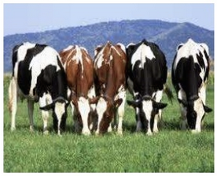

### Agile, DevOps, Continuous Delivery and Lean - How do you tie it all together in G- Cloud?
### Red Hat Breakout, Think Cloud for .gov 2014
Jeremy Brown - Head of Middleware UK&I, Red Hat

[@tenfourty] [1]
[1]: http://twitter.com/tenfourty/ "@tenfourty"
<jeremy@redhat.com>

---

## Let's TALK about the RED HAT model...

--

## Many variations vendors take on open source

* Some enable optimizations for their hardware <!-- .element: class="fragment" data-fragment-index="1" -->
* Some use open-core to upsell proprietary add-ons <!-- .element: class="fragment" data-fragment-index="2" -->
* Some invest in focused areas <!-- .element: class="fragment" data-fragment-index="3" -->
* Some contribute little and soley ship and support <!-- .element: class="fragment" data-fragment-index="4" -->

--

## AND SOME...
# GO ALL IN <!-- .element: class="fragment" data-fragment-index="1" -->

--

 <!-- .element: class="noshadow" fullscreen-size="contain" -->

--

## Shadowman update
### Reached $1.33B in FY13 <!-- .element: class="fragment highlight-red" -->

 <!-- .element: class="noshadow" -->

--

## Is Open Source a Business Model?

* No <!-- .element: class="fragment" data-fragment-index="1" -->
* But it is the best DEVELOPMENT model on the planet <!-- .element: class="fragment" data-fragment-index="2" -->
* Enables collaboration <!-- .element: class="fragment" data-fragment-index="3" -->
* Gives users flexibility to consume on their terms <!-- .element: class="fragment" data-fragment-index="4" -->

---

## Recap - Why are we doing this cloud thing anyway?

* Save money? - maybe
* Agility - turn our infrastructure into a PAYG utility model
* Lock in - Wastage of procurement... - repeat locking of proprietary in the cloud.

Note: "IT is changing dramatically, which is not to say there won't be some IT organizations 20 years from now that look like IT organizations did 20 years ago.

But when I think about the changes, increasingly the basic functions that IT organizations spent 70 percent of their time delivering — compute, storage, and networking — can be purchased, and they can be purchased from third parties. This is utility computing. So the organizations that figure that out and start to purchase those at commodity rates rather than continuing to generate custom solutions themselves will position themselves to get ahead.

--

## Now we need some buzzwords
### these are key themes that have influenced my thinking <!-- .element: class="fragment" data-fragment-index="1" -->

--

## [Pets vs Cattle] [1]

* Pets are given names like pussinboots.cern.ch <!-- .element: class="fragment" data-fragment-index="1" -->
* The are unique, lovingly hand raised and cared for <!-- .element: class="fragment" data-fragment-index="1" -->
* When they get ill, you nurse them back to health <!-- .element: class="fragment" data-fragment-index="1" -->
* Cattle are given numbers like vm0042.cern.ch <!-- .element: class="fragment" data-fragment-index="2" -->
* They are almost identical to other cattle <!-- .element: class="fragment" data-fragment-index="2" -->
* When they get ill, you get another one <!-- .element: class="fragment" data-fragment-index="2" -->

 <!-- .element: class="fragment" data-fragment-index="1" -->  <!-- .element: class="fragment" data-fragment-index="2" -->

Future application architectures should use Cattle but Pets with strong configuration management are viable and still needed <!-- .element: class="fragment" data-fragment-index="3" -->

[1]: http://www.slideshare.net/gmccance/cern-data-centre-evolution

--

## Continuous Delivery

 <!-- .element: class="noshadow" -->

https://en.wikipedia.org/wiki/Continuous_delivery

--

## Lean

--

## Devops

devops recap

---

## Infrastructure as Code

the implication of devops is infrastructure as code

---

## Customer's Vision

Red Hat Strategic Advisory Board (SAB) meeting with CIOs from several of our top customers:

> "They want to describe and automate all their systems and applications fully with software, from hardware up through complex, multi-tier apps and services.

> They want to provision and manage the lifecycle of everything (Linux and Windows, private and public clouds) in an automated fashion.

> Several said this was the holy grail for them" <!-- .element: class="fragment highlight-red" data-fragment-index="1" -->

---

## Meanwhile... Up in the G-Clouds

* We have many G-Clouds
* Clouds have different security classifications
* Clouds have different APIs - tied to the cloud provider so our apps are not portable

---

## Customer's Problem

Red Hat Strategic Advisory Board (SAB) meeting with CIOs from several of our top customers:

> "One of the problems they have is that everyone is defining APIs for their own platforms, but they can’t take workloads from one to another because the APIs they use for orchestration are different."

---

## Tying it all together

* How do we "plumb" an application together that has different bits in different clouds?
	* My data might be in one cloud
	* My main application(s) are in a different cloud
	* I might have a REST API exposed that runs in a third cloud

---

## Future: Vision

* Top-level application stack “manifest”
    * defines configuration and relationships of all services which comprise an application
    * cross-service (e.g. {NW,St,DB,I,aP,xP,LB,DNS}aaS)
    * defines how to create/update/delete the entire application, perhaps even suspend/resume
* Enables efficient automatic application creation and deletion
    * Relevant across dev, QA, prod
* An enabler for DevOps
* Defrag the Data Centre - free up resources

---

## Future: go “meta”

* Application stack templates
* Example: “give me a disaster resilient JEE app with a preconfigured database”

* App manifests move from Word documents to become machine-processable
    * Automatic reasoning about application estates (auto-scaling, capacity management, DR analysis, etc.)
    * Simplification, standardisation and efficiency gains across the board

---

## OpenStack Heat intro

---

## To Summarise

* We have a problem with each cloud provider having a different API, so our applications are still stuck and we can't treat our infrastructure as code
* If we can't treat our infrastructure as code we can't do real DevOps, Continuous Delivery and Lean
* We need an open standard and a project that we rally around for application orchestration
    * Is this Heat in the OpenStack project?
    * A Heat resource adapter for every G-Cloud?
* Come and join the discussion, we are a community!
    * email <jeremy@redhat.com>

---

## What do these have in common?
* Linux
* OpenStack
* Hadoop
* Rails
* MongoDB
* Git
* Cassandra

--

## What do these have in common?
* They are all open source
* They are all examples of next-generation IT solutions
* They were started by users and developers, not companies

--

## Cloud without open source software?
* No Amazon
* No Rackspace
* No Google
* No Yahoo!
* No Salesforce.com
* No LinkedIn
* No Pandora
* No Twitter
* No Facebook

---

## Thank you
This [presentation] [1] is running on [OpenShift] [2] 

and was developed in HTML5 with [reveal.js] [3]

Jeremy Brown [@tenfourty] [4]
[1]: http://pressos-runningonthe.rhcloud.com/redhatThinkGCloud2014.html
[2]: http://www.openshift.com/ "OpenShift"
[3]: https://github.com/hakimel/reveal.js "reveal.js"
[4]: http://twitter.com/tenfourty/ "@tenfourty"
<jeremy@redhat.com>

 <!-- .element: class="noshadow" -->

---

## More Information Slide

